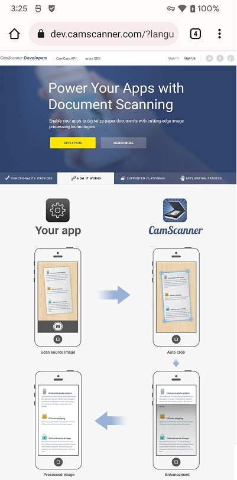
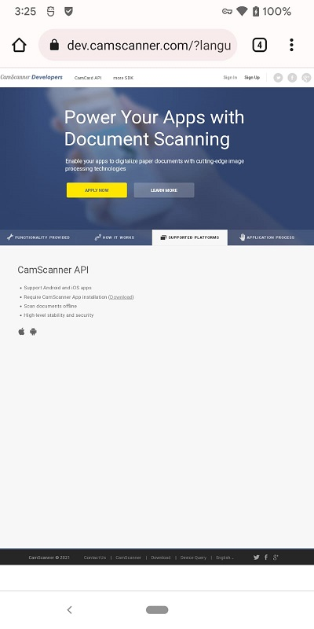
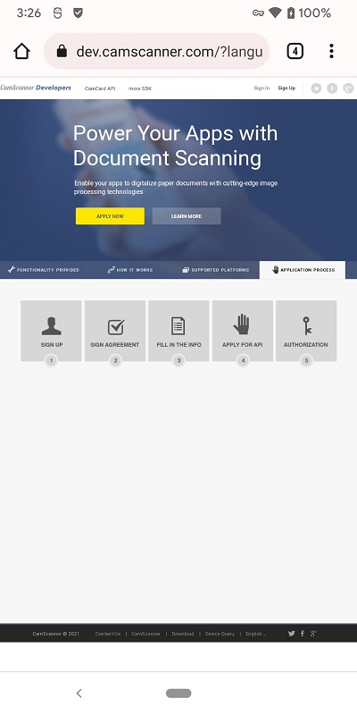

# Corner-Detect

- Hamad: corner adjustment + rotate
- Alishan: Google corner detections and silhouette extraction from images with tensorflow

## Danish

**Open CV libraries**

- https://github.com/jhansireddy/AndroidScannerDemo
- https://github.com/mayuce/AndroidDocumentScanner
- https://github.com/zynkware/Document-Scanning-Android-SDK
- https://github.com/CBerthias/Document_scanner
- https://scanbot.io/

**Paid SDK**
- https://geniusscansdk.com/
- https://dev.camcard.com/?language=en-us

 
 
 

## Shayan
- https://stackoverflow.com/questions/70290186/detect-bill-receipts-from-image-on-android
---
- https://teresa-wu.medium.com/googles-ml-kit-text-recognition-with-sample-app-of-receipts-reading-7fe6dc68ada3
- Detection of four corners of a document under different circumstances (https://stackoverflow.com/a/46203950/4754141)

**Paid SDK**
- https://www.pixelnetica.com/products/document-scanning-sdk/document-scanner-api-features.html
